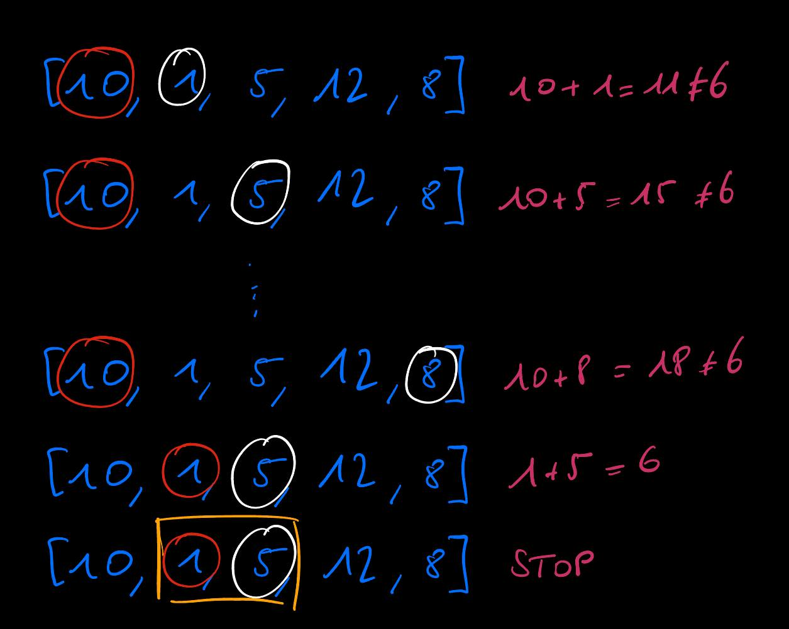
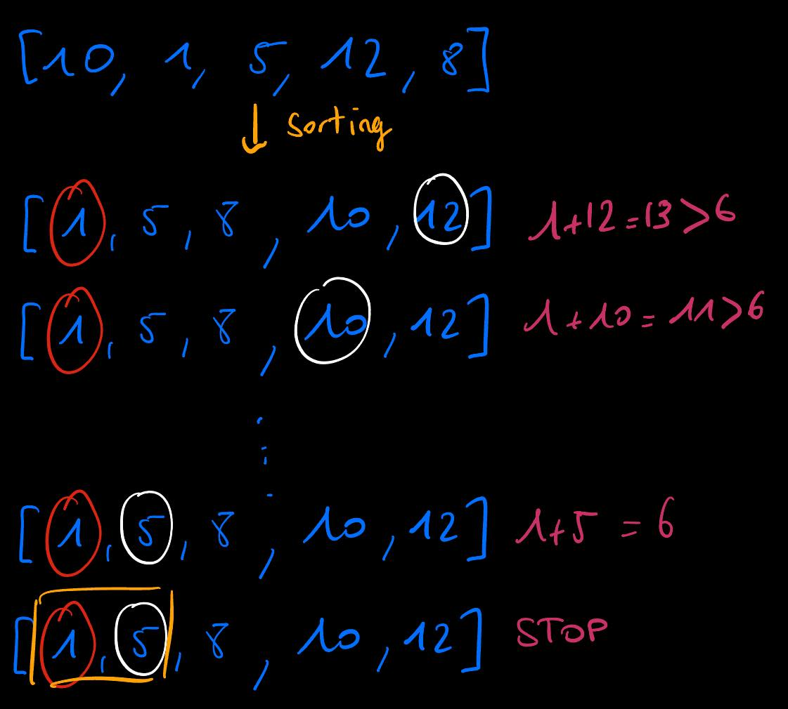
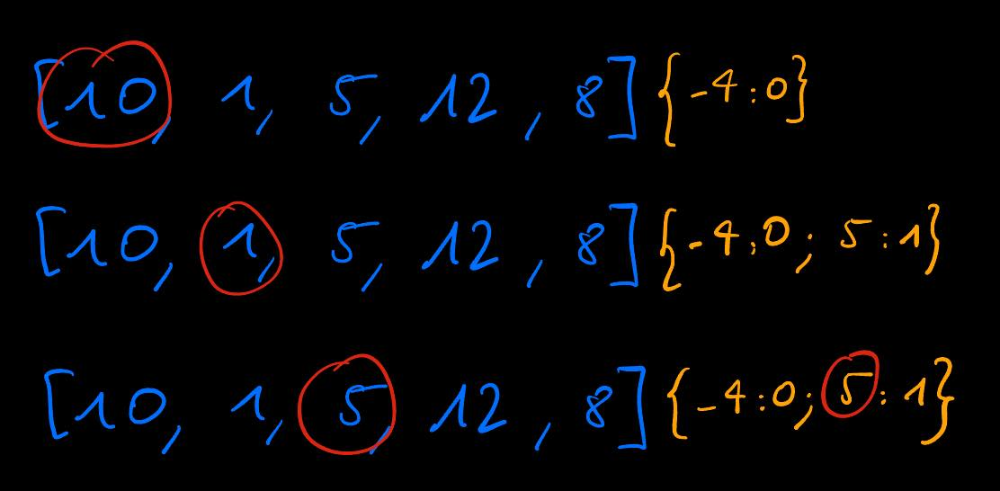

# Naive solution

The first solution is quite straightforward. The idea is to nest two for loops to look at each couple of numbers in <code>nums</code> until we find the <code>target</code>. 

A first pointer points to the first number in <code>nums</code> while a second pointer points to the second number. If the sum of these two numbers is <code>target</code> then the algorithm returns the indices of these two numbers, otherwise the second pointer moves to the next number in <code>nums</code>. When the second pointer reaches the end of the list, the first pointer moves to the next number and the second pointer points to the number next to it.

Here is an example with `target = 6`:

    

This solution results in <u>a worst time complexity of **O(n²)**.</u> 

# Solution with sorted list

To reduce the time complexity, we can also sort the <code>nums</code> list in a **O(nlog(n))** time complexity and then use two pointers <code>p1</code> and <code>p2</code>  at the beggining and end of the list respectively. We look at the sum of the two numbers, if the sum is lower than <code>target</code> then <code>p1</code> moves to the next element in the list (increasing the sum of the two pointers), else if the sum is higher than <code>target</code> then <code>p2</code> moves to the element before it in the list (decreasing the sum of the two pointers). Finally if the sum is <code>target</code> the program outputs the indices of these two numbers.

    

The time complexity comes from the sorting algorithm which results in <u>a worst time complexity of **O(nlog(n))**.</u> 

# Linear solution

The final solution involves a hash table. 

A pointer `p` go through `nums` and we compute the difference between `target` and `p`. If `p` is not in the hash table we store the difference as the key and the index of `p` in the list as the value in the hash table. If `p` is already in the hash table, the program outputs the index of `p` and the value associated to `p` in the hash table.

    

The solution results in <u>a linear worst time complexity.</u>