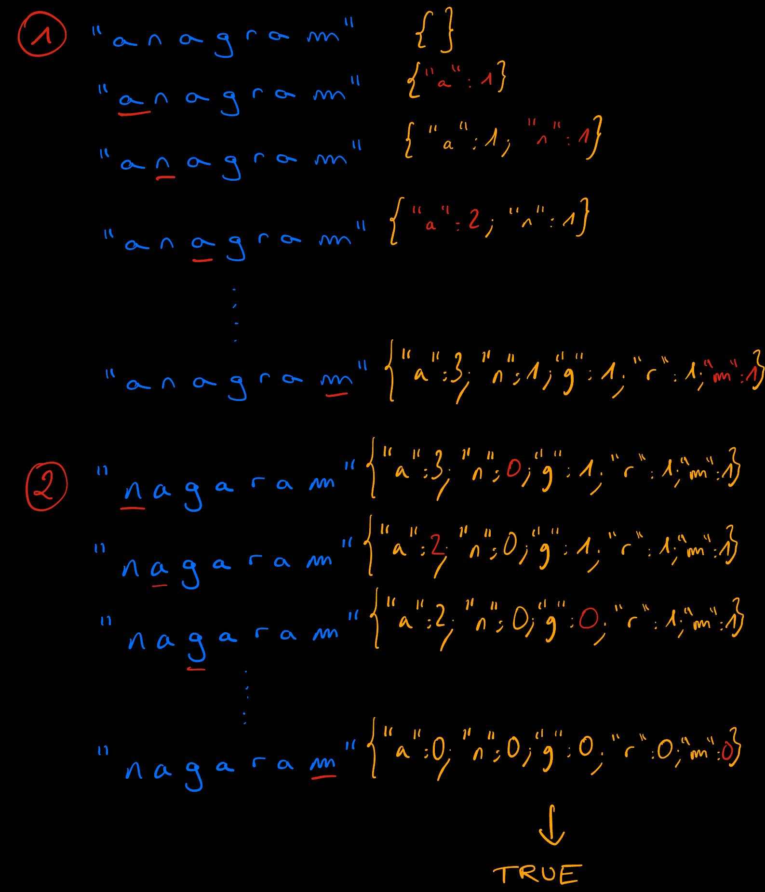
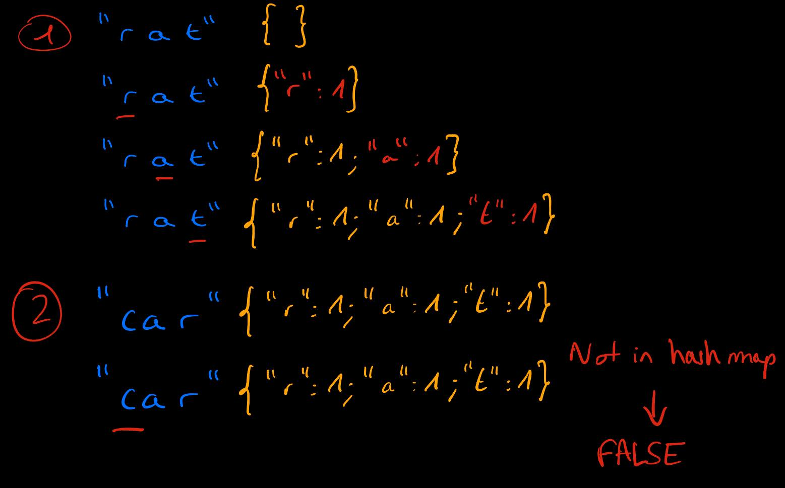

# Solution with sorting algorithm

The first naive solution is to sort both strings `s` and `t` and check if they are equal. Also if they do not have the same lenght, the program outputs `False`. 

This solution is fast to implement but leads to a worst time complexity of **O(nlog(n))** with `n` the length of `s`.

# Linear time solution - Hash Table

A better solution involves hash table. We iterate over `s` and count the number of times each character appears. 

We then iterate over `t` and decrement the frequency of each character when it appears. If one character is not in the hash table, the program outputs `False`. The same applies if a certain frequency goes below 0.

Finally if all frequencies are 0, the program outputs `True`, otherwise `False`.

Thus we reach a <u>time complexity of **O(n)** with `n` the length of `s`.</u>

Here is an example with `s = "anagram"` and `t = "nagaram"`:

    

And here with `s = "rat"` and `t = "car"`:

    

