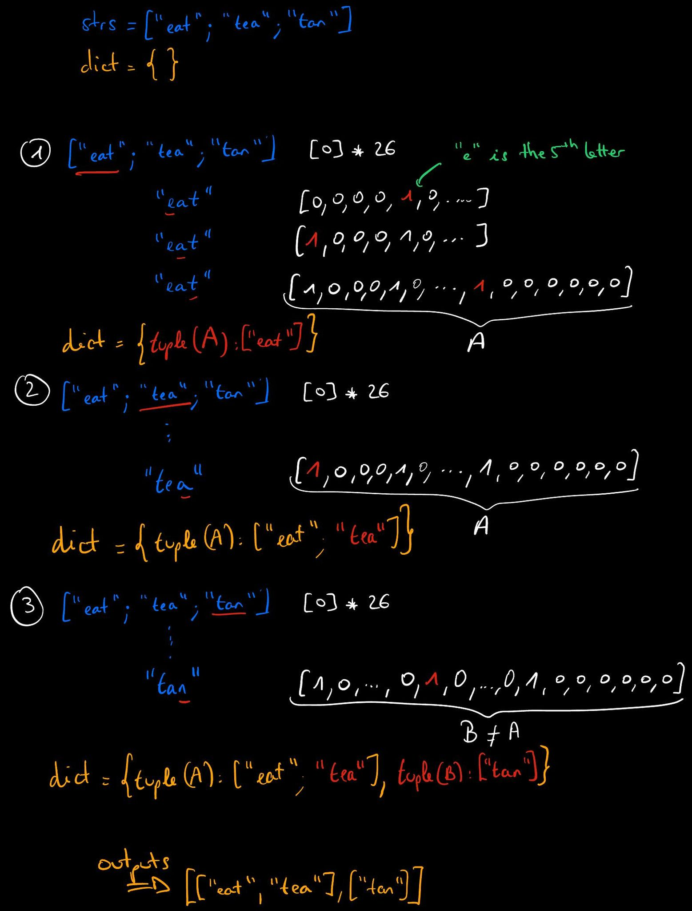

# Solution

We could use the same idea as in [242-valid-anagram](/242-valid-anagram/valid-anagram.md). 

We iterate over `strs` and for each string, we compute the dictionary composed of key-value pairs `(character: number of occurences in the string)`. The idea for this exercise would be to create another dictionary whose keys are these dictionaries and values are the strings associated to them. The problem is that dictionaries are not hashable and so can't be used as keys here.

The solution is to change the way we count frequencies of each letter in every string. Instead of using dictionary as in [242-valid-anagram](/242-valid-anagram/valid-anagram.md), we will use a list of 26 integers. The fact that all strings "consists of lowercase English letters" makes this choice very convenient. Thus, for each string in `strs`, we can use a list of 26 integers initially all zero to count the number of occurences of each letter in each string. Converting this list into a tuple will give us a hashable object usable as a key in the desired dictionary.

To sum up:

- Initialize a dictionary whose values will be lists
- Iterate over `strs`
- For each string in `strs`, initialize a list of 26 zeros
- For each letter in the string, increment its frequency
- Once each letter has been seen, convert the list into a tuple 
- Use the tuple as a key and append the string to the value (which is a list)

The program outputs the list of all values in the dictionary, so a list of lists of strings. 

<u>The time complexity of this program is **O(n×m)**</u> where `n` is the number of strings in `strs` and `m` the average number of letters per string.

Here is an example with `strs = ["eat", "tea", "tan"]`:

    

